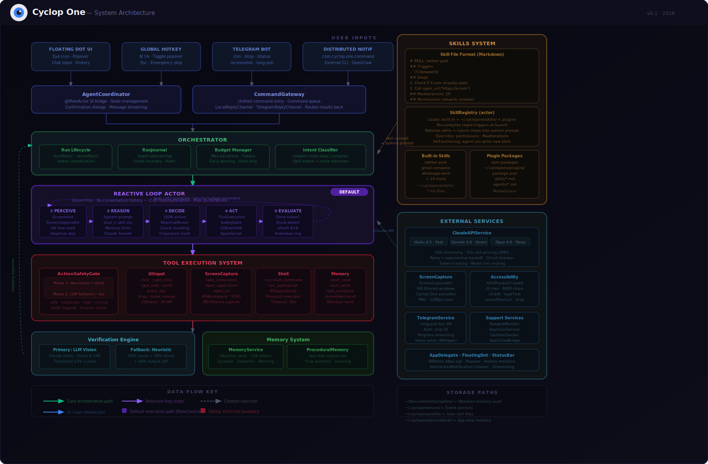

# Cyclop One

**An autonomous macOS desktop agent. The eye sees your screen, thinks with Claude, and acts.**

---

## What is Cyclop One?

Cyclop One is an AI-powered desktop automation agent for macOS. It uses Claude's vision capabilities to see your screen via ScreenCaptureKit, reasons about what it observes, and takes real actions — clicking buttons, typing text, running commands, and more. It is fully open source and built with zero third-party dependencies, relying entirely on Apple frameworks and the Claude API.

## Features

- **Vision-powered** — Claude sees your screen via ScreenCaptureKit
- **Full desktop control** — click, type, drag, scroll, keyboard shortcuts
- **Skills system** — extend with simple markdown files
- **Plugin architecture** — extend with any language via JSON-over-stdio
- **Memory system** — learns patterns across sessions
- **Voice input** — push-to-talk with local speech recognition
- **OpenClaw compatible** — control from Telegram, WhatsApp, Slack
- **Zero dependencies** — 100% Apple frameworks + Claude API

## Quick Start

```bash
# 1. Clone and build
git clone https://github.com/cyclop-one/cyclop-one.git
cd cyclop-one
xcodegen generate
open CyclopOne.xcodeproj
# Build and run (Cmd+R)

# 2. Set your Claude API key in the onboarding flow
# 3. Grant Accessibility + Screen Recording permissions
# 4. Start automating!
```

## Requirements

- macOS 14.0+
- Xcode 16+
- Claude API key from [console.anthropic.com](https://console.anthropic.com)

## Architecture

> Full architecture diagram and component reference: [docs/ARCHITECTURE.md](./docs/ARCHITECTURE.md)

[](./docs/ARCHITECTURE.md)

Cyclop One uses a vision-first reactive loop — each iteration takes a fresh screenshot, sends it to Claude with a system prompt, and executes the JSON action returned. No conversation history means ~2.2K tokens per iteration (~87% cheaper than stateful approaches).

| Component | Role |
|---|---|
| **ReactiveLoopActor** | Default agent loop — perceive → reason → act → evaluate, up to 35 iterations |
| **Orchestrator** | Run lifecycle, intent classification, budget management, crash recovery |
| **SkillRegistry** | Loads markdown skill files, matches by regex trigger, injects steps into prompt |
| **ActionSafetyGate** | Two-phase safety: heuristic rules → LLM fallback, four risk levels |
| **VerificationEngine** | Scores task completion — Claude Haiku vision primary, pixel/AX diff fallback |
| **MemoryService** | Obsidian vault-backed memory — 15K token injection budget per run |
| **ProceduralMemoryService** | App-specific step sequences learned across sessions |
| **FloatingDot** | 48px NSPanel eye — the only persistent UI surface |

## Skills

Skills are markdown files that teach Cyclop One how to perform specific tasks. Place them in `~/.cyclopone/skills/`:

```markdown
# Open Project

## Triggers
- "open project"
- "start working on {{project}}"

## Steps
1. Open Terminal
2. Run `cd ~/Projects/{{project}}`
3. Run `code .`

## Permissions
- filesystem
- app_launch
```

Cyclop One matches user intent against skill triggers and follows the defined steps, filling in parameters from context.

## Plugins

Plugins let you extend Cyclop One with any language. A plugin is an executable with a `plugin.json` manifest:

```json
{
  "name": "weather",
  "version": "1.0.0",
  "description": "Get current weather",
  "entrypoint": "./weather.py",
  "triggers": ["weather", "forecast"]
}
```

The plugin communicates over stdin/stdout using newline-delimited JSON. See [CONTRIBUTING.md](CONTRIBUTING.md) for the full protocol specification.

## Contributing

See [CONTRIBUTING.md](CONTRIBUTING.md) for development setup, code conventions, and how to submit changes.

## License

[MIT](LICENSE) — Copyright 2026, Cyclop One Contributors.
